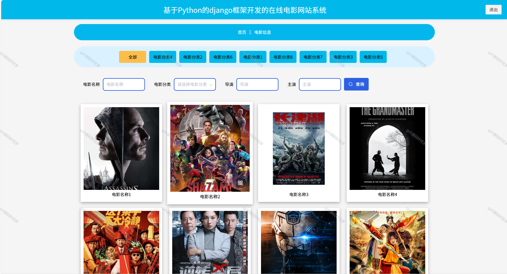
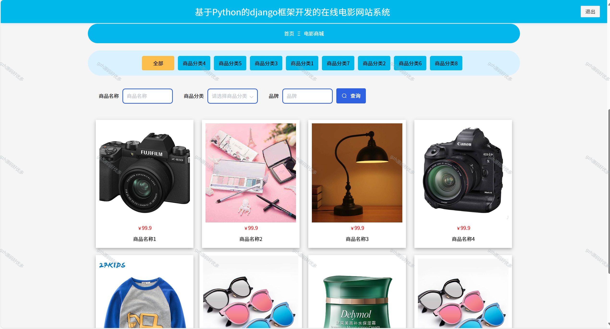
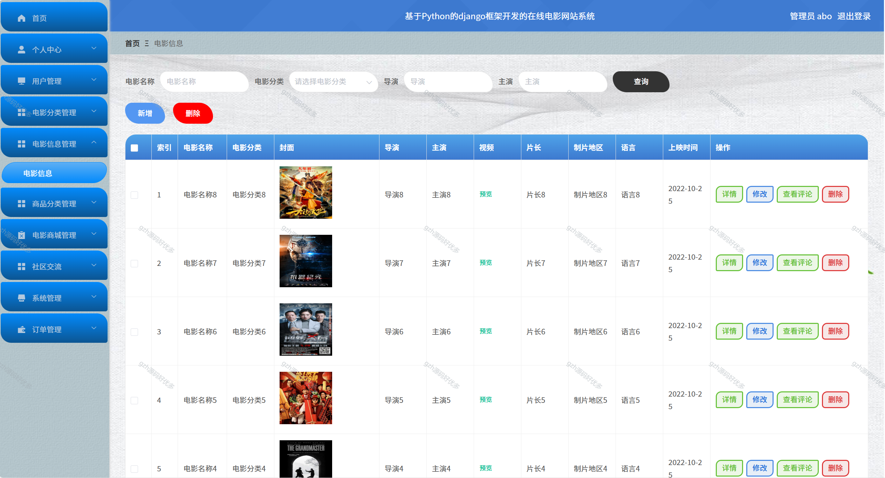

# python100
python100基于Python+Django的在线电影网站系统
 
## 查看主页获取源码

### 一、关键词
网络电影平台系统，在线影视网站系统，线上影院网站系统

### 二、作品包含
源码+数据库+全套环境和工具资源+本地部署教程

### 三、项目技术
前端技术：Vue2.0、Element-ui
后端技术：Python3.7、Django2.0

### 四、运行环境（以下版本亲测，其他版本兼容性请自行测试）
开发工具：PyCharm + VSCODE

数据库：MySQL5.7（最低要5.7版本）

数据库管理工具：Navicat10+

Python：Python3.7

前端Nodejs：14

浏览器：谷歌浏览器

### 五、项目介绍
项目编号：python0100

在线电影网站系统主要用于整合电影资源并提供在线播放服务，方便用户随时随地浏览、观看影片；同时支持用户管理、内容分类、播放记录追踪等功能，助力平台高效运营与用户体验优化。
基于 Python 的 Django 框架开发的在线电影网站系统，前台可浏览电影信息、逛电影商城、参与社区交流、查看电影资讯；后台支持管理员进行电影、商品分类、商城商品、社区交流等内容的管理与维护 。

### 六、运行截图

